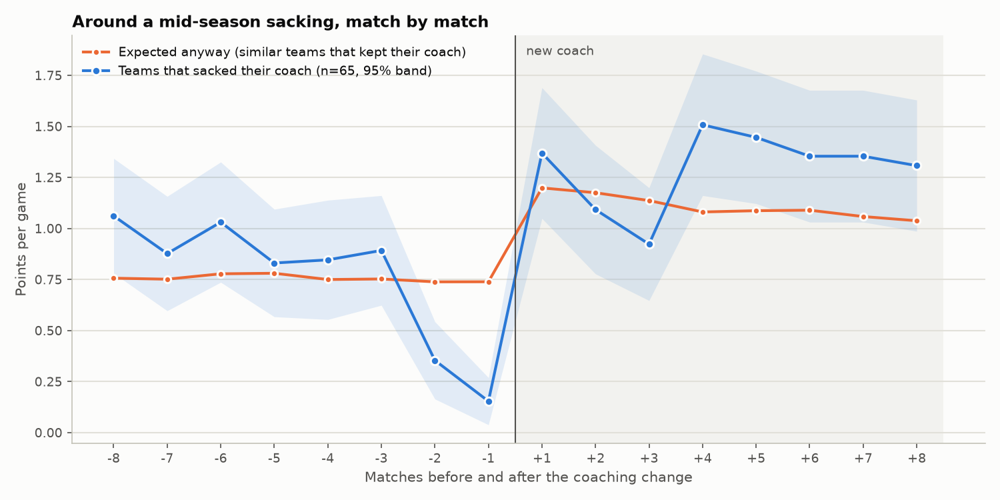
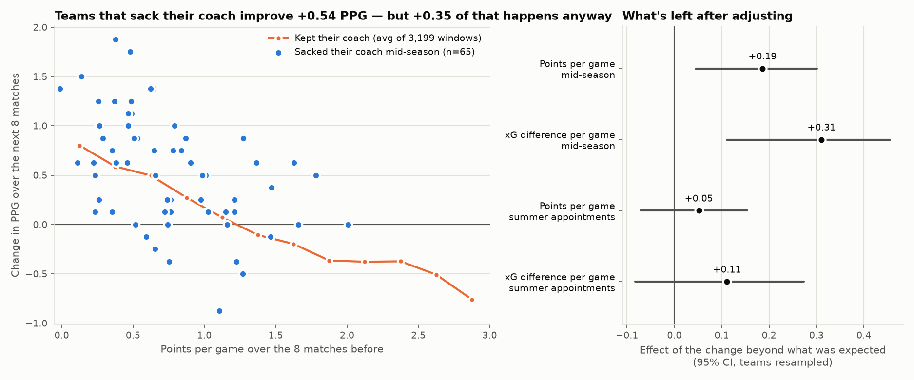
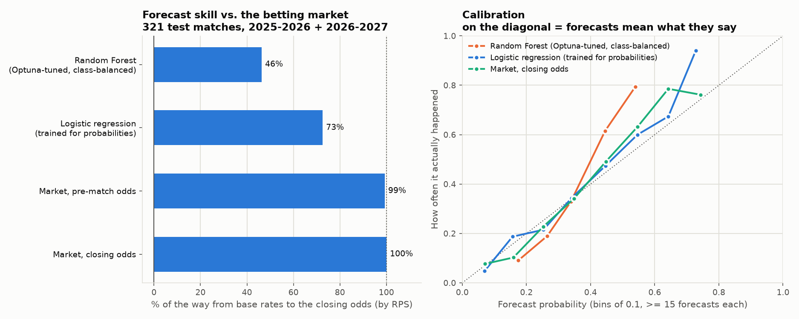
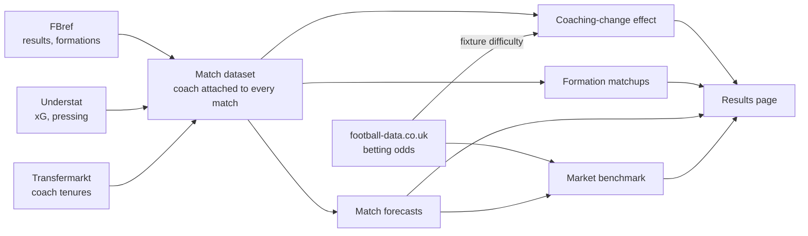

# Does sacking the coach work?

A Bundesliga analytics project: coaching changes measured against regression to the
mean, and match forecasts benchmarked against the betting market. Thirteen seasons
(2014-15 to 2026-27), 3,708 matches, four scraped sources.

[](https://github.com/FPN1997/bundesliga-coach-impact/actions/workflows/ci.yml)

**→ [Interactive results page](https://fpn1997.github.io/bundesliga-coach-impact/)** —
this week's **sack-o-meter** (every club's sack risk, how much it would recover anyway, and
what a change might add), every mid-season sacking since 2014, the forecast benchmark, and
forecasts for the next matchday. Refreshed automatically every week.

## Findings

### Most of the "new coach bounce" happens anyway. What's left is small: about +0.2 points per game

Teams that sack their coach mid-season take **+0.54 points per game** more over the next
8 matches than over the previous 8. But teams in the same slump that *kept* their coach
improved **+0.35** anyway, once the run of fixtures is accounted for too — bad runs end on
their own. That leaves **+0.19 points per game** for the change itself (95% interval
+0.04 to +0.30), across 65 mid-season sackings from 2014-15 to 2026-27. Two independent
measures agree:

- **Points:** +0.19 per game beyond expectation (+0.04 to +0.30).
- **Chance quality** (xG difference: the quality of chances created minus conceded, which
  doesn't depend on whether shots happen to go in): **+0.31 per game** beyond expectation
  (+0.11 to +0.46) — worth about +0.18 points per game.

It isn't just an easier run of fixtures (sacked teams' next 8 fixtures were barely easier
than usual, and adjusting for them changes the estimate from +0.16 to +0.19), and it isn't
mainly new signings: for the 39 sackings with no transfer window open afterwards — a frozen
squad — points still improved +0.20 per game beyond expectation. Summer appointments
show no clear effect (+0.05, −0.07 to +0.15). "The change" still means everything that
changes at that moment, not the new coach alone
([details](docs/results-in-depth.md#the-effect-of-a-coaching-change)).

Match by match, clubs pull the trigger right after a collapse — 0.25 points per game over
the last two matches, against about 0.74 expected — and after the change the sacked teams
sit above the expected line in six of the next eight matches. A collapse that late could
itself predict a bigger rebound, so the estimate was re-run adjusting for the last two
results as well: +0.18 per game, barely changed.



**Compared with published research.** Three peer-reviewed studies found no detectable
effect of a mid-season sacking: Heuer et al. (2011) on the Bundesliga 1963–2009, van Ours &
van Tuijl (2016) on the Eredivisie, and Lundkvist et al. (2026) on 331 changes across
Europe. Run through the two designs that can be reproduced from match data, this project's
data give +0.11 and +0.12 points per game. Those estimates are positive, but their
intervals include zero, just as in the papers. Everyone agrees that most of the bounce is
regression to the mean. Whether a small real effect remains is at the edge of what 50–65
sackings can resolve. This project's design says yes at every horizon from 4 to 12
matches except 10, the horizon the papers use, where the interval ends at zero. So
read +0.19 as "small, probably between zero and +0.3", not as proven
([comparison](docs/results-in-depth.md#how-this-compares-with-published-research)).

**More leagues are on the way.** The study is built to pool the top-5 European leagues:
results and xG from Understat, odds from football-data.co.uk, one baseline per league.
Four more leagues' worth of sackings (the Bundesliga alone has 65) should narrow the
interval a lot, maybe enough to settle "small or nothing". Each league joins automatically once its coach histories
are complete; they're downloading politely from Transfermarkt in the background
([how](docs/results-in-depth.md#more-leagues)).



*Each blue dot is a mid-season sacking; the orange line is what teams in the same
position that kept their coach did. The comparison adjusts for points and xG before the
change and for the difficulty of the fixtures before and after, and the intervals
resample whole teams. Method:
[results-in-depth.md](docs/results-in-depth.md#the-effect-of-a-coaching-change).*

### The match forecasts get 72% of the way to the betting market

On 321 held-out matches, a logistic regression on rolling form, xG, pressing and coach
tenure closes **72% of the gap** between naive base rates and the closing betting odds,
measured by ranked probability score (the standard for football forecasts). A tuned
Random Forest does much worse, at 46%: it was trained to catch draws, and overestimates
them (33% on average, against a real draw rate of 24%).



### Most tuning "wins" were noise

An earlier run ranked Optuna-tuned Random Forest as the clear best pre-match model
(macro-F1 0.522). After a week's data refresh — the tuning itself is deterministic — it
scored 0.491, and with five more seasons of training data 0.492; the other tuning
conclusions reshuffled each time. At this sample size, differences of a few hundredths
between tuning methods aren't real; the untuned models are as good as anything. The
robust comparison is the probabilistic benchmark above.
([details](docs/results-in-depth.md#hyperparameter-tuning))

### A coach's track record doesn't predict the size of the bounce

For 67 changes where the incoming coach had coached at least 10 earlier matches in the
data, a model can predict how big the points swing will be (leave-one-out R² +0.28) — but
all of that comes from how bad the run was beforehand, i.e. regression to the mean again
(team form alone: +0.33). The incoming coach's own record adds nothing (on its own: −0.04).
([details](docs/results-in-depth.md#coach-bounce-predictor))

### The sack-o-meter: the study, applied to this week

The results page turns the analysis into a weekly table (`src/sack_o_meter.py`). For each club it shows:

- **Sack risk:** the chance of a new coach within the next 4 matches. It comes from a model
  trained on 5,840 club-weeks since 2014, using form against what the betting market
  expected, the last two results, xG, the coach's time in the job and how far into the season
  it is.
- **Recovery anyway:** the points a club in that position takes if it keeps its coach.
- **What a change adds:** the study's estimate, shown only for clubs whose form is in the
  range where sackings actually happen.

Tested season by season, on seasons it never saw, the risk model ranks clubs better than
points alone (AUC 0.79 against 0.76). Its
percentages hold up: clubs given 20%–35% had a change
27% of the time. It predicts what clubs *do*, not what they should do
([details](docs/results-in-depth.md#sack-o-meter)).

**Track record, 2014–2026:** scored by a model that never saw that season, 49 of the
92 mid-season changes were already in the meter's top 3 one match before the club's last
match under the outgoing coach (53%; by chance, 17%). After
that last match, 67 of 93 were (72%). The other way round, most
clubs near the top keep their coach: only 22% of top-3 readings were followed
by a change within 4 matches.

### Formation matchups


*Grey is the league average (1.38 points per game). Raw averages mix up "this formation
works" with "strong teams use this formation"; the outcome model's
[form-adjusted version](docs/results-in-depth.md#formation-matchups) separates them.*

## How it works



- **Leak-safe features.** Every rolling statistic uses only matches strictly before the
  one being predicted, and evaluation is a strict time split. Both properties are tested.
- **Proper scoring.** Forecasts are scored with RPS, log loss and calibration against
  bookmaker odds, with bootstrap intervals — not just accuracy.
- **Self-maintaining data.** New clubs' Transfermarkt ids and name spellings resolve
  automatically; every scraper refuses to overwrite good data with a suspiciously small
  scrape; a weekly job refreshes everything, with a watchdog, retries and a failure
  notification.

## Quickstart

```bash
git clone https://github.com/FPN1997/bundesliga-coach-impact.git
cd bundesliga-coach-impact
python3.13 -m venv .venv && source .venv/bin/activate
pip install -e ".[dev]"        # on macOS also: brew install libomp (XGBoost needs it)
bundesliga pipeline            # scrape, merge, run the analyses (~5 min; needs Chrome for FBref)
bundesliga reproduce           # every model and number in this README, in order (~20 min)
```

Forecast a match from each team's current form:

```bash
bundesliga predict --team "Bayern Munich" --opponent Dortmund --venue home
```

```
Bayern Munich (home=True) vs Dortmund
Model: logistic_regression (prematch, regularization chosen by time-ordered CV)

  Bayern Munich win 66.1%  ##########################
  Draw             18.3%  #######
  Dortmund win     15.6%  ######
```

| Command | What it does |
|---|---|
| `bundesliga pipeline [--skip-fetch]` | Scrape (or reuse) the data, merge it, run the coach-impact and formation analyses |
| `bundesliga coach-effect` | Effect of a coaching change beyond regression to the mean |
| `bundesliga benchmark [--refresh-odds]` | Score the forecasts against betting odds |
| `bundesliga sack-o-meter` | This week's sack risk, recovery and change effect per club (also runs in `pipeline`) |
| `bundesliga train` / `tune --method grid\|embargoed\|optuna` | Train or tune the outcome classifiers |
| `bundesliga predict ...` | Forecast a match (`--help` for options) |
| `bundesliga site` | Rebuild the results page in `site/` (published on push) |
| `bundesliga reproduce` | Every modelling step, in dependency order |

Requires Python 3.11+. `pip install -r requirements-lock.txt && pip install -e . --no-deps`
reproduces the exact tested environment.

## Engineering

- **81 tests** on synthetic data, covering leak-safety, the time split, the coaching-change
  estimator (a planted effect must be recovered, and zero reported when there is none),
  the scoring rules, the scraper guards and name resolution. CI runs lint and tests on
  Python 3.11 and 3.13, plus a weekly end-to-end run of the real pipeline on a fixture
  dataset.
- **Bugs caught by checking rather than assuming**, each of which produced plausible
  output rather than an error — a formation feature one match stale, class weights
  distorting probabilities, a heatmap centred on the wrong average, results silently lost
  to a race between two tuning runs. Written up in
  [engineering-notes.md](docs/engineering-notes.md#bugs-found-and-fixed).

## Limitations

- **Small samples.** 65 mid-season sackings; 321 test matches. The intervals are wide, and
  the write-up says so wherever it matters.
- **Observational data.** Clubs don't sack at random. The adjustment covers recent points,
  xG and fixture difficulty, not everything a club's board knows.
- **Data freshness depends on the scrapers.** FBref, Understat and Transfermarkt can
  change or block access without notice; that has already happened once
  (Transfermarkt's `.com` domain).

## More

- [docs/results-in-depth.md](docs/results-in-depth.md) — methods and every result, including the
  ones that didn't hold up
- [docs/engineering-notes.md](docs/engineering-notes.md) — data sources, scraping, automation,
  tests, configuration, bugs found

```
cli.py                 the `bundesliga` command
predict.py             match forecasts from current form
config.py              seasons, windows, name/id mappings
src/                   pipeline stages, analyses, models, results-page builder
tests/                 pytest suite
scripts/               weekly refresh (launchd) and the end-to-end fixture run
site/                  the published results page
docs/                  write-ups and the charts in this README
```

MIT licensed.
