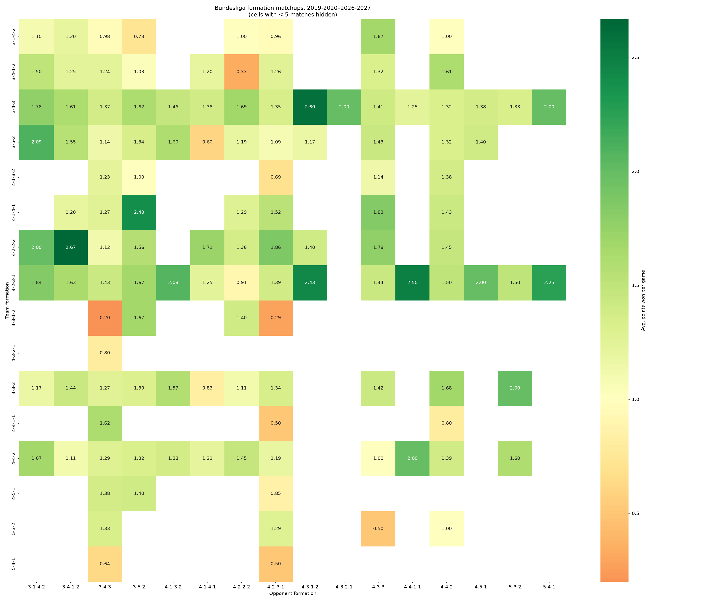
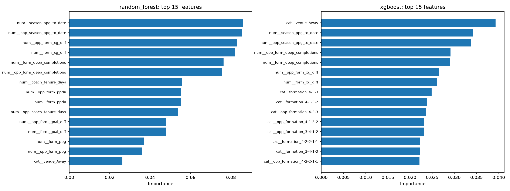
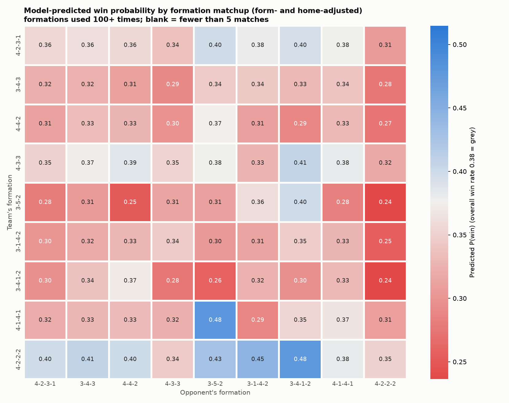
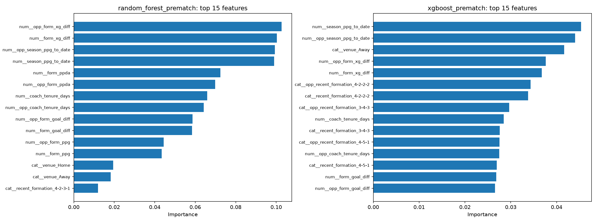

# Bundesliga Coach Impact Analyzer

Does a coaching change actually change results? And does the incoming coach
bring a different formation with them? This pipeline builds a match-level
Bundesliga dataset (results, formations, xG, PPDA) with the coach in charge
of each match attached, then:

1. **Coach impact rankings** — for every coaching change, compares
   points-per-game / goal difference / xG difference / PPDA in the matches
   immediately before vs. after, and ranks changes by biggest swing.
2. **Formation matchup matrix** — average points won per game for every
   (team formation, opponent formation) pairing, as a heatmap.
3. **Coach preferred formations** — each coach's most-used formation during
   their tenure, joined onto the impact rankings so you can see whether a
   PPG swing came with a tactical change too.
4. **Formation-aware outcome predictor** — Random Forest and XGBoost
   classifiers predicting win/draw/loss from formations plus rolling form,
   xG, PPDA, and coach tenure, evaluated on a strict time-based holdout
   (see [below](#formation-aware-outcome-predictor)).



*Average points won per game by formation matchup, 2019-20 through the
ongoing 2026-27 season — generated by `src/formation_matrix.py`.*

## Data sources

| Data | Source | How |
|---|---|---|
| Results + formations | [FBref](https://fbref.com) | [`soccerdata.FBref`](https://soccerdata.readthedocs.io/en/latest/datasources/FBref.html) |
| xG + PPDA (pressing) | [Understat](https://understat.com) | [`soccerdata.Understat`](https://soccerdata.readthedocs.io/en/latest/datasources/Understat.html) |
| Coach tenure dates | Transfermarkt "Trainerhistorie" pages | `src/fetch_coach_history.py` (custom scraper) + manual CSV fallback |

`soccerdata` doesn't cover Transfermarkt or any manager-history source, so
coach tenure is the one piece scraped by hand here. Wikipedia was tried
first — the plan was to use its "List of `<club>` managers" pages, which
looked clean and scraper-friendly — but verified live, Bundesliga clubs
mostly don't have that page on English Wikipedia (every guessed URL 404'd).
Transfermarkt's own manager-history table turned out to be the reliable
source: it returns a normal 200 to a plain `requests` call with a browser
User-Agent (no login/JS wall for this page), and the URL only cares about
the club's numeric id, verified live for Bayern Munich and Heidenheim.
Treat `data/coach_history_manual.csv` as the correction file: it
overrides/augments whatever the scraper produces, and is where you fill in
any club with no id in `config.CLUB_TRANSFERMARKT_ID` (logged clearly when
that happens) or patch a spell it got wrong.

## Setup

Requires **Python 3.10+** (`soccerdata` doesn't support 3.9). On this
machine that means using `/opt/homebrew/bin/python3.13` rather than the
system `python3`.

```bash
cd bundesliga-coach-impact
/opt/homebrew/bin/python3.13 -m venv .venv
source .venv/bin/activate
pip install -r requirements.txt
```

FBref access goes through a headless Chrome driver under the hood
(`soccerdata` uses `seleniumbase`) — the first run downloads a matching
`chromedriver` automatically.

## Run

```bash
python run_pipeline.py
```

This runs, in order: FBref fetch → Understat fetch → coach-history fetch →
merge → coach-impact analysis → formation-matrix analysis. Outputs land in
`outputs/`:

- `coach_impact_rankings.csv`
- `formation_matchup_matrix.csv` + `formation_matchup_heatmap.png`
- `coach_preferred_formations.csv`

Already have raw data cached and just want to re-run the analysis (e.g.
after editing `config.IMPACT_WINDOW`)?

```bash
python run_pipeline.py --skip-fetch
```

Or run one stage at a time while iterating:

```bash
python -m src.fetch_fbref
python -m src.fetch_understat
python -m src.fetch_coach_history
python -m src.build_dataset
python -m src.coach_impact
python -m src.formation_matrix
```

Then, once `match_dataset.parquet` exists, train the outcome predictor:

```bash
python run_outcome_predictor.py
```

...optionally, its genuine pre-match variant (recent-formation-tendency
instead of actual matchday formation — see
[below](#pre-match-forecaster-variant)):

```bash
python run_prematch_predictor.py
```

...and optionally grid-search hyperparameters for the actual-formation
variant (takes a few minutes; appends `<model>_tuned` entries to
`outcome_model_metrics.json` alongside the untuned ones rather than
replacing them):

```bash
python run_tune_hyperparameters.py
```

All three append to the same `outputs/outcome_model_metrics.json` rather
than overwriting each other, so results from every run you've done stay
visible side by side.

## Formation-aware outcome predictor

`src/features.py` builds a leak-safe feature table: every rolling/cumulative
stat (form PPG, goal difference, xG difference, PPDA, season-to-date PPG,
days into the current coach's tenure) is `.shift(1)`'d before any window is
applied, so a match's features only ever come from that team's *strictly
prior* matches. `src/outcome_predictor.py` trains a Random Forest and an
XGBoost classifier on that table to predict win/draw/loss, with the two
formations (own + opponent's) as categorical features alongside the form
stats.

**Evaluation is a time-based holdout** — `config.TEST_SEASONS`
(2025-26 + the ongoing 2026-27) is held out entirely; training only ever
sees earlier matches. A random row-level split would leak future results
into training through the rolling features' shared history and wildly
overstate accuracy, which is a classic way sports-prediction demos quietly
cheat — this pipeline deliberately doesn't.

Latest run (602 held-out matches):

| | Accuracy | Macro F1 | vs. majority-class baseline (37.9%) | vs. home-advantage-only baseline (43.9%) |
|---|---|---|---|---|
| Random Forest (balanced) | 47.8% | 0.464 | +9.9pp | +3.9pp |
| **XGBoost (balanced)** | **49.7%** | **0.489** | **+11.8pp** | **+5.8pp** |

Both models clear the home-advantage baseline — the simplest signal a
football outcome model needs to beat to be worth anything — with the draw
class weighted to actually attempt predicting draws (unweighted, both
models learned it's "cheapest" to never predict D at all; recall on draws
alone jumped from 0% to 34-45% once weighted, at a small cost to overall
accuracy). Football match prediction genuinely tops out in this range in
published research — a much higher number here would be a leakage red flag,
not a win.



Formation categories place throughout the top-15 feature importances (own
and opponent formation each contribute meaningfully, alongside home/away,
season form, xG form, and coach tenure) — real but secondary signal, not the
dominant one. `outputs/formation_matchup_predicted.png` shows the same
(formation, opponent formation) heatmap as the raw one above, but built from
the model's predicted win probability instead of the raw average — i.e.
adjusted for form and home advantage rather than conflating "this formation
wins more" with "teams using this formation also tend to be in better form":



**Framing, honestly**: `formation`/`opp_formation` here are the formations
*actually fielded in that match* — known at kickoff to the two coaches, not
to a forecaster the day before. That makes this an explanatory model
("which formation choices tend to pair with wins, controlling for form") 
rather than a pre-kickoff bookmaker-style predictor.

### Pre-match forecaster variant

`python run_prematch_predictor.py` trains the genuine pre-match version:
`formation`/`opp_formation` swapped for `recent_formation`/
`opp_recent_formation` — each team's most common formation over its last
`FEATURE_ROLLING_WINDOW` matches, computed the same shift-safe way as every
other feature (see `src/features.py`'s `_rolling_mode`). Recent-formation
matches the actual matchday formation only about half the time, so this is
a genuinely different, noisier categorical signal — not a formality.

The result isn't the clean "pre-match is a bit worse, as expected" story
you'd guess going in:

| | Actual formation | Recent-formation (pre-match) | Δ macro F1 |
|---|---|---|---|
| Random Forest | 0.464 | **0.481** | **+0.017** |
| XGBoost | **0.489** | 0.467 | −0.022 |

Random Forest actually *improves* on the pre-match feature, XGBoost gets
slightly worse — the opposite pattern for each model. The explanation is
in the data, not the models being fussy: `formation` has 19 distinct
categories in this dataset (many one-off, rare tactical tweaks), while
`recent_formation` has 16, with more mass concentrated on the handful of
formations teams actually settle into. Random Forest's default splits
(`min_samples_leaf=5`) are prone to carving out noisy little leaves for
rare formation categories; smoothing that away by using recent tendency
instead evidently helps more than the lost information hurts. XGBoost's
boosted-tree regularization was apparently already handling that noise
well enough that the real signal in knowing the *exact* matchday formation
outweighs it. You can see this in the feature importances too — recent
Random Forest leans almost entirely on numeric form/PPDA/coach-tenure
features with `recent_formation` barely registering, while XGBoost still
finds several `recent_formation` categories worth real weight:



**Bottom line**: if you actually need a pre-kickoff forecast (the entire
point of "pre-match"), XGBoost with actual-formation training data isn't
usable — you don't have that data before kickoff. Between the two
pre-match-legal options, **Random Forest on recent-formation (0.481 macro
F1) is the one to use**, and it's competitive with — not meaningfully worse
than — the explanatory XGBoost model that gets to see the real matchday
formation (0.489). That's a more useful and more interesting finding than
either "formation doesn't matter" or "of course the honest version is
worse" would have been.

### Hyperparameter tuning

`src/tune_hyperparameters.py` grid-searches both models (`GridSearchCV`,
scoring on macro-F1) with **`TimeSeriesSplit`, not the default random
K-fold, for cross-validation** — a random K-fold would train on some
matches from *after* the ones it validates against within the same fold,
reintroducing the exact leakage the outer train/test split already guards
against, just one level down. Grid: `n_estimators`/`max_depth`/
`min_samples_leaf` for the forest, plus `learning_rate`/`subsample` for
XGBoost (12 and 16 combinations respectively, x5 CV folds each).

Honest result: **tuning didn't help, and slightly hurt both models** on the
real held-out test set, despite finding better configurations by CV score
during the search itself:

| | CV macro-F1 (search) | Test accuracy | Test macro F1 |
|---|---|---|---|
| Random Forest (untuned) | — | 47.8% | 0.464 |
| Random Forest (tuned) | 0.435 | 48.0% | 0.462 |
| XGBoost (untuned) | — | 49.7% | **0.489** |
| XGBoost (tuned) | 0.411 | 49.2% | 0.476 |

The gap between the tuned configs' CV scores (0.41-0.44) and their eventual
test scores (0.46-0.48) is the tell: `TimeSeriesSplit`'s early folds train
on very little data and are noisier than the final full-training-set +
602-match holdout evaluation, so the search is optimizing against a shakier
signal than the number it's ultimately judged on. With a dataset this size
(3,388 training matches) and hand-picked starting hyperparameters that
were already reasonable, there wasn't much on the table for tuning to find
— and reporting that honestly is more useful than re-running the grid
until a lucky seed looks better. The untuned XGBoost model remains the one
actually worth using; tuned models are saved to
`outputs/models/*_tuned.joblib` alongside the untuned ones rather than
replacing them, so both are there to compare.

## Configuration

Everything tunable lives in `config.py`:

- `SEASONS` — how far back to pull. Formation and PPDA coverage is reliable
  from ~2014-15 onward; the default runs 2019-20 through the ongoing
  2026-27 season. Unplayed fixtures in an in-progress season are dropped
  automatically in `build_dataset.py` (they'd otherwise pad out
  matches-played counts with rows that have no actual result).
- `FEATURE_ROLLING_WINDOW` / `TEST_SEASONS` / `MODEL_DIR` — outcome
  predictor settings: rolling-form window size, which seasons are held out
  for evaluation, where trained models get saved.
- `CLUB_TRANSFERMARKT_ID` — team name → Transfermarkt numeric club id, used
  to build that club's manager-history URL. Newly promoted clubs not yet in
  this dict need their id looked up (see the comment above the dict in
  `config.py`) or their tenure data entered via the manual CSV instead.
- `TEAM_NAME_MAP` — Understat's team names don't match FBref's; this maps
  Understat's spelling to the canonical FBref one used everywhere else.
  `build_dataset.py` logs any Understat team name it can't map.
- `IMPACT_WINDOW` — how many matches before/after a coaching change count as
  the "before" and "after" samples (default 8).

## Known rough edges (this is a scaffold, not a finished pipeline)

- **Column names**: the exact columns `soccerdata` returns can shift
  slightly between versions. Every fetch script logs the columns it got on
  first run — if `build_dataset.py` or `formation_matrix.py` throws a
  `KeyError`/`RuntimeError`, check that log line first before assuming the
  scraper logic is wrong.
- **Transfermarkt club ids**: only Bayern Munich (27) and Heidenheim (2036)
  were individually verified live; the rest of `CLUB_TRANSFERMARKT_ID` are
  Transfermarkt's well-known stable ids but weren't each re-checked. The
  scraper compares the fetched page's `<title>` against the club name and
  logs a loud warning if an id looks wrong, so a bad id won't fail
  silently — but do spot-check `data/processed/coach_history.csv` against
  the live Transfermarkt page for a club or two before trusting the impact
  rankings. Very short caretaker spells (a handful of matches) are the most
  likely thing to produce a noisy-looking row — `matches_before`/
  `matches_after` in the output tell you when a row is thin.
- **FBref rate limiting**: `soccerdata` paces requests to be polite, so a
  fresh 6-season pull takes a few minutes, not seconds. Cached responses
  live under `data/raw/` (soccerdata also has its own cache dir under
  `~/soccerdata/data/`) so re-running doesn't re-fetch everything.
- **Small-sample cells**: the formation heatmap hides any (formation,
  opponent formation) pairing with fewer than `MIN_MATCHUP_SAMPLES` (5)
  matches — a single upset shouldn't paint a whole cell green or red.
- **New teams each time `SEASONS` widens**: `CLUB_TRANSFERMARKT_ID` and
  `TEAM_NAME_MAP` only cover teams actually seen in a completed run so far.
  Widening `SEASONS` (or waiting for a new promotion) will surface a fresh
  `No coach-history rows for team=X` / unmapped-Understat-name warning —
  expected, not a sign something's broken; fix it the same way the existing
  entries were resolved (verify a Transfermarkt id live against the page's
  `<title>` before trusting it — one early guess for Greuther Fürth
  resolved to a completely different club).
- **A `pd.Timestamp.today()` bug already bit this once**: an early version
  of `fetch_coach_history.py` mapped an incumbent coach's blank "still
  active" end-date to *today's date* instead of leaving it open-ended. That
  silently capped every current coach's tenure at scrape time, so every
  future/in-progress-season fixture got no coach assigned at all once
  `SEASONS` grew to include the ongoing season. Fixed by leaving it as
  `None`/NaT and letting `build_dataset.py`'s `fillna(2100-01-01)` treat it
  as open-ended — worth knowing about if you ever touch date parsing here.
- **pandas 3.0 + pyarrow-backed columns**: comparing a pyarrow-backed
  Series's raw `.values` against a plain numpy array (e.g. in a baseline
  accuracy calculation) raises `AttributeError: 'ArrowExtensionArray'
  object has no attribute 'mean'` instead of just working. Use `.to_numpy()`
  rather than `.values` when you need a real numpy array out of a column
  read from these parquet files.

## Extending

- Swap `config.LEAGUE`/`SEASONS` to `"GER-Bundesliga2"` (verify the exact
  code via `soccerdata.FBref(leagues=...).available_leagues()`) to run the
  same pipeline on 2. Bundesliga.
- The "new coach bounce predictor" idea from the brainstorm — predicting
  swing size from pre-change form + incoming coach's historical PPDA/
  formation profile — slots in as a model trained on
  `outputs/coach_impact_rankings.csv` plus a coach-history feature table
  built from `coach_preferred_formations.csv`.
- Hyperparameter-tune the pre-match variant too (`run_tune_hyperparameters.py`
  currently only tunes the actual-formation models) — with Random Forest
  the stronger pre-match option, its 12-combo grid is cheap to point at
  `FORMATION_COLS_PREMATCH` instead.
- `src/tune_hyperparameters.py` covers a modest grid; a wider one or
  `Optuna`/`RandomizedSearchCV` might turn up something the current grid
  doesn't reach — though per the tuning section above, don't expect much
  from this dataset size without also addressing the CV-vs-test-score gap
  (e.g. more `TimeSeriesSplit` folds, or a purged/embargoed CV variant).
- Try target = expected points / goal difference (regression) instead of
  win/draw/loss (classification) — draws are inherently the hardest class
  here, and a lot of that difficulty may just wash out with a continuous
  target.
