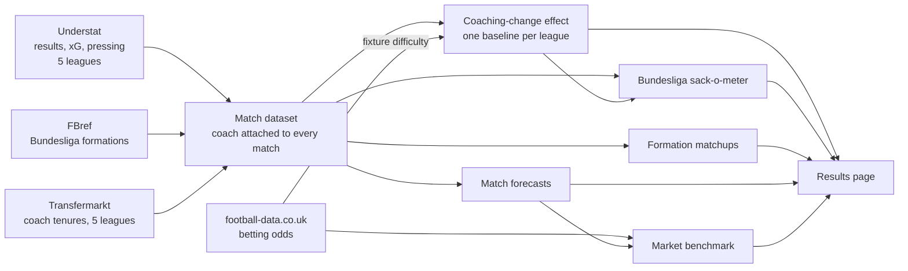

# Does sacking the coach work?

A football analytics project. The main question: once you account for the fact that bad
runs end on their own, does sacking the coach mid-season help? It's answered on **384
mid-season sackings in Europe's top five leagues**, 2014-15 to 2026-27 (21,839 matches).
Around it: a weekly Bundesliga sack-o-meter, and Bundesliga match forecasts benchmarked
against the betting market.

[](https://github.com/FPN1997/bundesliga-coach-impact/actions/workflows/ci.yml)

**→ [Interactive results page](https://fpn1997.github.io/bundesliga-coach-impact/)** —
the coaching-change study league by league, this week's Bundesliga **sack-o-meter** (every
club's sack risk, how much it would recover anyway, and what a change might add), the
forecast benchmark, and forecasts for the next matchday. Refreshed automatically every week.

## Findings

### Sacking the coach helps a little: about +0.1 points per game. Most of the "bounce" happens anyway

Across 384 mid-season sackings in the Premier League, La Liga, Bundesliga, Serie A and
Ligue 1, teams take **+0.44 points per game** more over the next 8 matches than over the
previous 8. But teams in the same slump that *kept* their coach improved **+0.35** anyway:
bad runs end on their own. That leaves **+0.10 points per game** for the change itself
(95% interval +0.04 to +0.14). That's about a fifth of the raw bounce, or a little under
one extra point over those 8 matches. Two independent measures agree:

- **Points:** +0.10 per game beyond expectation (+0.04 to +0.14).
- **Chance quality** (xG difference: the quality of chances created minus conceded, which
  doesn't depend on whether shots happen to go in): **+0.19 per game** beyond expectation
  (+0.13 to +0.24), worth about +0.12 points per game.

| League | Mid-season sackings | Points per game beyond expected | xG difference beyond expected |
|---|---|---|---|
| Premier League | 71 | +0.12 (−0.01 to +0.23) | +0.14 (+0.02 to +0.24) |
| La Liga | 91 | +0.05 (−0.07 to +0.14) | +0.14 (+0.01 to +0.23) |
| Bundesliga | 65 | +0.19 (+0.04 to +0.30) | +0.31 (+0.11 to +0.46) |
| Serie A | 83 | +0.09 (−0.02 to +0.19) | +0.18 (+0.06 to +0.28) |
| Ligue 1 | 74 | +0.07 (−0.03 to +0.15) | +0.21 (+0.08 to +0.31) |
| **All five, pooled** | **384** | **+0.10 (+0.04 to +0.14)** | **+0.19 (+0.13 to +0.24)** |

Every league's interval contains the pooled estimate, so the leagues are consistent with one
small effect. But a single league mostly can't tell an effect this size from zero. This
project first ran on the Bundesliga alone and reported +0.19. That turned out to be the top
of the range, as a small sample's estimate often is.

**Other explanations don't account for it:**

- **Easier fixtures.** Sacked teams' next 8 fixtures were barely easier than usual, and
  adjusting for them moves the estimate from +0.07 to +0.10.
- **New signings.** For the 239 sackings with no transfer window open afterwards (a frozen
  squad), points still improved +0.10 per game beyond expectation (+0.03 to +0.17).
- **The time of year.** Summer appointments show no effect (−0.01, −0.08 to +0.05).

"The change" still means everything that changes at that moment, not the new coach alone
([details](docs/results-in-depth.md#the-effect-of-a-coaching-change)).

**Match by match,** clubs pull the trigger right after a collapse: 0.40 points per game over
the last two matches, against about 0.77 expected. After the change, the sacked teams sit
above the expected line in all eight of the next matches. A collapse that late could itself
predict a bigger rebound, so the estimate was re-run adjusting for the last two results as
well: +0.09 per game, barely changed.


**Compared with published research.** Three peer-reviewed studies found no detectable
effect of a mid-season sacking:

- Heuer et al. (2011), on the Bundesliga 1963–2009;
- van Ours & van Tuijl (2016), on the Eredivisie;
- Lundkvist et al. (2026), on 331 changes across Europe.

Run through the two designs that can be reproduced from match data, this project's
five-league data give:

- **+0.08 (+0.01 to +0.13) with Heuer et al.'s design**, clearly above zero;
- **+0.02 (−0.04 to +0.07) with Lundkvist et al.'s**, which matches on points alone.

Comparing on recent points alone misses the effect. On Lundkvist et al.'s matches, adjusting
for xG and fixture difficulty as well gives +0.06 (+0.005 to +0.10). The published nulls fit
this picture: an effect of about +0.1 is too small for one study's sackings to separate from
zero reliably. Heuer et al.'s own estimate (+0.02, roughly
−0.05 to +0.09) overlaps the bottom of this interval
([comparison](docs/results-in-depth.md#how-this-compares-with-published-research)).


*Each blue dot is a mid-season sacking in one of the five leagues; the orange line is what
teams in the same position that kept their coach did. The comparison adjusts for points
and xG before the change and for the difficulty of the fixtures before and after, with one
baseline per league, and the intervals resample whole teams. Method:
[results-in-depth.md](docs/results-in-depth.md#the-effect-of-a-coaching-change).*

### Bundesliga match forecasts get 72% of the way to the betting market

On 321 held-out matches, a logistic regression on rolling form, xG, pressing and coach
tenure closes **72% of the gap** between naive base rates and the closing betting odds,
measured by ranked probability score (the standard for football forecasts). A tuned
Random Forest does much worse, at 46%: it was trained to catch draws, and overestimates
them (33% on average, against a real draw rate of 24%).


### Most tuning "wins" were noise

An earlier run ranked Optuna-tuned Random Forest as the clear best pre-match model
(macro-F1 0.522). After a week's data refresh — the tuning itself is deterministic — it
scored 0.491, and with five more seasons of training data 0.492; the other tuning
conclusions reshuffled each time. At this sample size, differences of a few hundredths
between tuning methods aren't real; the untuned models are as good as anything. The
robust comparison is the probabilistic benchmark above.
([details](docs/results-in-depth.md#hyperparameter-tuning))

### In the Bundesliga, a coach's track record doesn't predict the size of the bounce

For 67 changes where the incoming coach had coached at least 10 earlier matches in the
data, a model can predict how big the points swing will be (leave-one-out R² +0.28) — but
all of that comes from how bad the run was beforehand, i.e. regression to the mean again
(team form alone: +0.33). The incoming coach's own record adds nothing (on its own: −0.04).
([details](docs/results-in-depth.md#coach-bounce-predictor))

### The Bundesliga sack-o-meter: the study, applied to this week

The results page turns the analysis into a weekly table (`src/sack_o_meter.py`). For each club it shows:

- **Sack risk:** the chance of a new coach within the next 4 matches. It comes from a model
  trained on 5,840 club-weeks since 2014, using form against what the betting market
  expected, the last two results, xG, the coach's time in the job and how far into the season
  it is.
- **Recovery anyway:** the points a club in that position takes if it keeps its coach.
- **What a change adds:** the study's five-league estimate (+0.10 per game), shown only for
  clubs whose form is in the range where sackings actually happen.

Tested season by season, on seasons it never saw, the risk model ranks clubs better than
points alone (AUC 0.79 against 0.76). Its
percentages hold up: clubs given 20%–35% had a change
27% of the time. It predicts what clubs *do*, not what they should do
([details](docs/results-in-depth.md#sack-o-meter)).

**Track record, 2014–2026:** scored by a model that never saw that season, 49 of the
92 mid-season changes were already in the meter's top 3 one match before the club's last
match under the outgoing coach (53%; by chance, 17%). After
that last match, 67 of 93 were (72%). The other way round, most
clubs near the top keep their coach: only 22% of top-3 readings were followed
by a change within 4 matches.

### Bundesliga formation matchups


*Grey is the league average (1.38 points per game). Raw averages mix up "this formation
works" with "strong teams use this formation"; the outcome model's
[form-adjusted version](docs/results-in-depth.md#formation-matchups) separates them.*

## How it works


```mermaid
flowchart LR
    US[Understat<br/>results, xG, pressing<br/>5 leagues] --> DS[Match dataset<br/>coach attached to every match]
    FB[FBref<br/>Bundesliga formations] --> DS
    TM[Transfermarkt<br/>coach tenures, 5 leagues] --> DS
    DS --> CE[Coaching-change effect<br/>one baseline per league]
    DS --> SM[Bundesliga sack-o-meter]
    DS --> FM[Formation matchups]
    DS --> FC[Match forecasts]
    FD[football-data.co.uk<br/>betting odds] --> MB[Market benchmark]
    FD -->|fixture difficulty| CE
    FC --> MB
    CE --> SM
    CE & SM & FM & FC & MB --> WEB[Results page]
```

- **Leak-safe features.** Every rolling statistic uses only matches strictly before the
  one being predicted, and evaluation is a strict time split. Both properties are tested.
- **Proper scoring.** Forecasts are scored with RPS, log loss and calibration against
  bookmaker odds, with bootstrap intervals — not just accuracy.
- **Self-maintaining data.** New clubs' Transfermarkt ids and name spellings resolve
  automatically; every scraper refuses to overwrite good data with a suspiciously small
  scrape; a weekly job refreshes everything, with a watchdog, retries and a failure
  notification.

## Quickstart

```bash
git clone https://github.com/FPN1997/bundesliga-coach-impact.git
cd bundesliga-coach-impact
python3.13 -m venv .venv && source .venv/bin/activate
pip install -e ".[dev]"        # on macOS also: brew install libomp (XGBoost needs it)
bundesliga pipeline            # scrape, merge, run the analyses (~5 min; needs Chrome for FBref)
bundesliga reproduce           # every model and number in this README, in order (~20 min)
```

Forecast a match from each team's current form:

```bash
bundesliga predict --team "Bayern Munich" --opponent Dortmund --venue home
```

```
Bayern Munich (home=True) vs Dortmund
Model: logistic_regression (prematch, regularization chosen by time-ordered CV)

  Bayern Munich win 66.1%  ##########################
  Draw             18.3%  #######
  Dortmund win     15.6%  ######
```

| Command | What it does |
|---|---|
| `bundesliga pipeline [--skip-fetch]` | Scrape (or reuse) the data, merge it, run the coach-impact and formation analyses |
| `bundesliga coach-effect` | Effect of a coaching change beyond regression to the mean |
| `bundesliga benchmark [--refresh-odds]` | Score the forecasts against betting odds |
| `bundesliga sack-o-meter` | This week's sack risk, recovery and change effect per club (also runs in `pipeline`) |
| `bundesliga train` / `tune --method grid\|embargoed\|optuna` | Train or tune the outcome classifiers |
| `bundesliga predict ...` | Forecast a match (`--help` for options) |
| `bundesliga site` | Rebuild the results page in `site/` (published on push) |
| `bundesliga reproduce` | Every modelling step, in dependency order |

Requires Python 3.11+. `pip install -r requirements-lock.txt && pip install -e . --no-deps`
reproduces the exact tested environment.

## Engineering

- **81 tests** on synthetic data, covering leak-safety, the time split, the coaching-change
  estimator (a planted effect must be recovered, and zero reported when there is none),
  the scoring rules, the scraper guards and name resolution. CI runs lint and tests on
  Python 3.11 and 3.13, plus a weekly end-to-end run of the real pipeline on a fixture
  dataset.
- **Bugs caught by checking rather than assuming**, each of which produced plausible
  output rather than an error — a formation feature one match stale, class weights
  distorting probabilities, a heatmap centred on the wrong average, results silently lost
  to a race between two tuning runs. Written up in
  [engineering-notes.md](docs/engineering-notes.md#bugs-found-and-fixed).

## Limitations

- **Small effects need big samples.** 384 mid-season sackings are enough to separate a
  +0.1 effect from zero, but not to pin down its size precisely (+0.04 to +0.14), nor to
  tell the leagues apart. The forecasts are tested on 321 matches. The write-up gives
  intervals wherever it matters.
- **Observational data.** Clubs don't sack at random. The adjustment covers recent points,
  xG and fixture difficulty, not everything a club's board knows.
- **Data freshness depends on the sources.** FBref and Transfermarkt block automated
  access from time to time. Every fetch stops at the first refusal and keeps the previous
  data, and results come from Understat, so the study doesn't depend on either.
  ([engineering notes](docs/engineering-notes.md#data-sources)).

## More

- [docs/results-in-depth.md](docs/results-in-depth.md) — methods and every result, including the
  ones that didn't hold up
- [docs/engineering-notes.md](docs/engineering-notes.md) — data sources, scraping, automation,
  tests, configuration, bugs found

```
cli.py                 the `bundesliga` command
predict.py             match forecasts from current form
config.py              seasons, windows, name/id mappings
src/                   pipeline stages, analyses, models, results-page builder
tests/                 pytest suite
scripts/               weekly refresh (launchd) and the end-to-end fixture run
site/                  the published results page
docs/                  write-ups and the charts in this README
```

MIT licensed.
