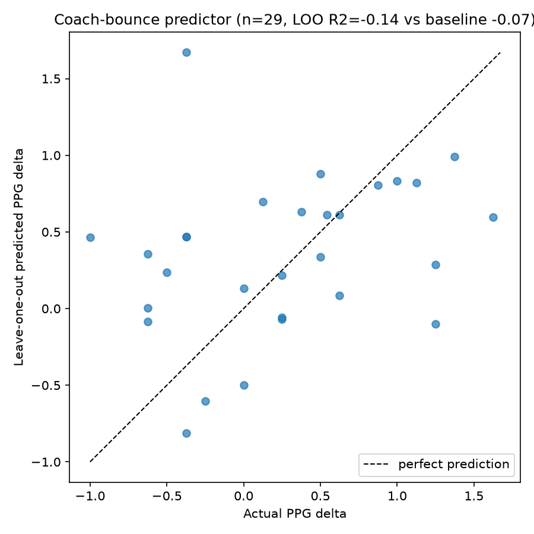

# Results in depth

The full modelling write-up. The [README](../README.md) has the headline findings;
[engineering-notes.md](engineering-notes.md) covers the pipeline, tests and automation.
Every number here comes from one `bundesliga reproduce` run on data through
2026-09-20; the held-out test set is the 2025-26 season plus the 2026-27 matches played
so far (317 matches).

- [The effect of a coaching change](#the-effect-of-a-coaching-change)
- [Match forecasts vs. the betting market](#match-forecasts-vs-the-betting-market)
- [The outcome classifiers](#the-outcome-classifiers)
- [Hyperparameter tuning, and what didn't replicate](#hyperparameter-tuning)
- [XGBoost native categorical splits](#xgboost-native-categorical-splits)
- [Coach-bounce predictor](#coach-bounce-predictor)
- [Formation matchups](#formation-matchups)

## The effect of a coaching change

`src/coach_change_effect.py`, run with `bundesliga coach-effect`.

A raw before/after comparison of a sacking is badly confounded: clubs sack coaches after
bad runs, and bad runs recover on their own. So every coaching change is compared with
"control" windows — the same 8-matches-before / 8-matches-after comparison at moments
when a team did **not** change coach.

- **Windows.** For each team and match *i*: the 8 matches before *i* vs. the 8 from *i*
  on. "Treated" if the coach changes exactly at *i* (and the before-half belongs to a
  single coach); "control" if one coach covers all 16 matches; otherwise skipped.
- **Mid-season vs. summer.** A window spanning the summer break mixes in transfers and
  pre-season, so mid-season sackings — the "new coach bounce" people argue about — are
  the headline, and summer appointments are estimated separately against summer-spanning
  controls.
- **Adjustment.** The expected change for each treated window comes from a linear
  regression fit on control windows only, on PPG before (how bad the run was) and xG
  difference before (how much of it was bad luck rather than bad play). Regression to
  the mean is linear in the before-value, and the binned control means sit on the
  fitted line (see the chart).
- **Uncertainty.** Control windows from one team overlap and are strongly correlated, so
  the 95% intervals come from a bootstrap that resamples whole teams.

A first attempt used coarsened exact matching on the same two variables. It had to drop
11 of 39 mid-season sackings — the worst runs, where control windows are rare — which
are exactly the cases the question is about, so it was replaced.

| | n | Raw change | Expected anyway | Effect | 95% interval |
|---|---|---|---|---|---|
| **Points per game, mid-season** | 39 | +0.50 | +0.40 | **+0.09** | −0.06 to +0.23 |
| **xG difference per game, mid-season** | 39 | +0.43 | +0.11 | **+0.32** | +0.08 to +0.56 |
| Points per game, summer | 39 | +0.31 | +0.23 | +0.07 | −0.09 to +0.22 |
| xG difference per game, summer | 39 | +0.19 | +0.05 | +0.14 | −0.12 to +0.40 |

*(controls: 1,876 mid-season windows, 921 summer-spanning)*

**Reading it.** About 80% of the points "bounce" after a mid-season sacking is what
similar teams that kept their coach did anyway. Both rows are effects of the coaching
change, estimated identically; they differ in what they measure:

- **xG difference** (quality of chances created minus conceded) improves 0.32 per game
  beyond expectation, with an interval that excludes zero.
- **Points** improve 0.09 per game beyond expectation — positive in 87% of the bootstrap
  resamples, but the interval includes zero.

The two agree. Across the control windows, +1 xG difference per game goes with +0.57
points per game over 8 matches, so the xG gain implies about +0.18 PPG (+0.05 to +0.32
across its interval), which the points interval comfortably contains. Points are just
much noisier: over 8 matches, finishing and goalkeeping luck move PPG by about ±0.37
(the spread of 8-match PPG not explained by xG), and with 39 sackings that alone is
enough to blur an effect of this size. The most likely truth is a real but modest effect
of roughly +0.1 to +0.2 PPG — a fraction of the raw +0.50 bounce. Summer appointments
show no clear effect on either measure.

"The coaching change" means everything that changes at the same moment: a January
signing, players returning from injury, a softer run of fixtures (opponent strength
isn't adjusted for) — not the new coach alone.

The biggest positive surprise in the data is Xabi Alonso replacing Gerardo Seoane at
Leverkusen in October 2022: +1.38 PPG against an expected +0.62.

**Limitations.** 39 mid-season changes is a small sample; the windows are 8 matches; the
adjustment is linear in two variables; and clubs don't sack at random — a club might sack
precisely when it expects the run to continue, which would bias the effect downward.
Caretaker spells are kept as changes.

## Match forecasts vs. the betting market

`src/market_benchmark.py`, run with `bundesliga benchmark`.

Beating "always pick the home team" says little. The benchmark that matters in football
forecasting is the betting market, whose odds reflect injuries, lineups, form and a lot
of money. Forecasts are scored with proper scoring rules — **RPS** (ranked probability
score, the football standard, since home win/draw/away win are ordered), log loss and
Brier score — against margin-free implied probabilities from the market-average odds on
football-data.co.uk.

| Forecaster | RPS | Log loss | Accuracy | Gap closed |
|---|---|---|---|---|
| Base rates (training-set home/draw/away frequency) | 0.2316 | 1.067 | 44.5% | 0% |
| Random Forest (Optuna-tuned, class-balanced) | 0.2067 | 1.005 | 49.8% | 60% |
| **Logistic regression (trained for probabilities)** | **0.2028** | **0.988** | **54.9%** | **70%** |
| Market, pre-match odds (Fri/Tue before) | 0.1906 | 0.950 | 55.5% | 100% |
| Market, closing odds | 0.1904 | 0.948 | 56.8% | 100% |

"Gap closed" = how far from base rates to the closing odds, by RPS. Paired bootstrap
intervals (over matches): both models beat base rates clearly, and both trail the market
clearly.

Two findings:

- **The simpler model has better probabilities.** The Random Forest was trained with
  class-balanced weights so it would predict draws at all — which raised macro-F1, the
  metric it was tuned on, but inflates draw probabilities: across the test set it gives
  draws 33% on average, against an actual draw rate of 24% (the market prices them at 24%,
  the logistic regression at 26%). A logistic regression trained without balancing, with
  regularization chosen
  by time-ordered cross-validation on log loss, is better on every probabilistic score.
  `bundesliga predict` now defaults to it.
- **Against Pinnacle, the sharpest bookmaker,** on the 136 matches where football-data
  has its odds (Pinnacle's columns end in January 2026), the logistic regression gets 52%
  of the way. The market average is within 2% of Pinnacle on those same matches, so the
  lower number reflects that stretch (August 2025 to January 2026) being harder for a
  form-based model, not Pinnacle being much sharper. One plausible reason, not tested:
  early-season form features still describe last season's squad.

## The outcome classifiers

`src/features.py` builds the feature table; `src/outcome_predictor.py` trains a Random
Forest and an XGBoost classifier (`bundesliga train`).

**Leak-safety is the core correctness property.** Every rolling statistic — form PPG,
goal difference, xG difference, PPDA, deep completions, season-to-date PPG, coach
tenure — is `.shift(1)`'d before the window, so a match's features come only from that
team's earlier matches. Evaluation is a strict time split: training never sees the
test seasons. A random split would leak future results through the rolling features and
overstate accuracy.

Two variants:

- **Actual formation** uses the formations fielded in the match. That's explanatory ("which
  formation choices pair with wins, given form"), not a forecast — nobody knows the
  opponent's matchday formation beforehand.
- **Pre-match** uses each team's most common formation over its last 5 matches instead, so
  everything is known before kickoff.

| Macro F1 (accuracy) | Actual formation | Pre-match |
|---|---|---|
| Random Forest | 0.492 (50.8%) | 0.503 (51.4%) |
| XGBoost | 0.492 (50.2%) | 0.508 (52.2%) |

*(baselines: majority class 38.0%, home-advantage-only 44.5%)*

Knowing the actual matchday formation doesn't measurably help over the recent tendency —
if anything the pre-match variant scores a little higher, within noise. Both classes of
model clear the home-advantage baseline by 6–8 points. Draws are weighted so the models
attempt them at all (unweighted, both learn never to predict a draw).

Deep completions (Understat passes into the final third) were added later as a feature.
On the data at the time they appeared to lift macro-F1 by 0.01–0.04 — which, by the
standard of the next section, is within noise. They're kept because they're cheap and
principled, not because they demonstrably helped.

## Hyperparameter tuning

`bundesliga tune --method grid|embargoed|optuna`.

All three methods tune on macro-F1 with **time-ordered** cross-validation
(`TimeSeriesSplit`, 10 folds) — a random K-fold would validate on matches earlier than
some of its training matches, reintroducing the leakage the time split exists to prevent.

- **Grid**: `GridSearchCV` over tree count, depth and leaf size (plus learning rate and
  subsample for XGBoost).
- **Embargoed**: the same grid, with an 18-row gap (one matchday) between each fold's
  training and validation slice, since rolling features make the first validation
  matches almost copies of the last training matches.
- **Optuna**: 50 trials of TPE sampling over a wider space.

| Macro F1 | Untuned | Grid | Grid + embargo | Optuna |
|---|---|---|---|---|
| Random Forest, actual | 0.492 | **0.505** | **0.505** | 0.479 |
| XGBoost, actual | **0.492** | 0.462 | 0.484 | 0.480 |
| Random Forest, pre-match | **0.503** | 0.489 | **0.503** | 0.491 |
| XGBoost, pre-match | **0.508** | 0.478 | 0.478 | 0.447 |

**Tuning doesn't reliably help, and the earlier story didn't replicate.** An earlier run
(mid-September, data through Sept 12) told a tidy story: Optuna-tuned Random Forest was
the clear best pre-match model (0.522), and the embargo fixed XGBoost specifically
(+0.035 pre-match). On this run, with a week more data, both are gone: that Random Forest
scores 0.491, and the embargo's pre-match XGBoost gain is zero.

The tuning is deterministic — two seeded runs give identical hyperparameters and scores —
so the difference comes from the data: the weekly refresh re-scrapes every season, and
small revisions to historical rows changed where the searches landed. A result that
flips with a week's data revision isn't a result. At ~317 test matches, macro-F1
differences of a few hundredths between tuning methods are noise; the untuned models are
as good as anything here.

One thing held up across both runs: cross-validation scores (0.40–0.45) sit well below
test scores (0.45–0.51), because the early `TimeSeriesSplit` folds train on very little
data, which makes them a noisy target to tune against. The comparison that is robust is
the probabilistic one above, which uses proper scoring rules and reports confidence
intervals.

## XGBoost native categorical splits

`bundesliga native-categorical`.

XGBoost 2.0+ can split on categories directly (`enable_categorical=True`) instead of
one-hot encoding them. With every hyperparameter held at the untuned baseline's values:

| Macro F1 | One-hot | Native categorical |
|---|---|---|
| Actual formation | **0.492** | 0.482 |
| Pre-match | **0.508** | 0.473 |

One-hot wins both, in this run and the earlier one. The likely reason: at `max_depth=4`,
one-hot gives each formation its own split, while a native split has to partition more
than a dozen formations into two groups at a time. Native categorical support pays off at much higher
cardinality, where one-hot's column explosion is the real problem.

## Coach-bounce predictor

`src/coach_bounce.py`, run with `bundesliga bounce`.

Can the *size* of a coaching change's PPG swing be predicted from the team's form before
the change plus the incoming coach's own record — their results in whatever earlier
matches they coached, at any club, strictly before the appointment?

Only 29 of 108 coaching changes have an incoming coach with at least 10 prior matches in
this dataset (most are new to management, or their earlier jobs predate 2019 or were
outside the Bundesliga). With 29 rows, it's evaluated by leave-one-out cross-validation
against "always predict the average":

| | Leave-one-out R² | MAE |
|---|---|---|
| Ridge regression | −0.139 | 0.567 |
| Predict the average | −0.073 | 0.596 |

Worse R², slightly better MAE: no usable signal. The one stable coefficient is the
intuitive one, `ppg_before` (−0.80) — a team doing worse beforehand improves more,
i.e. regression to the mean again, which the coaching-change analysis above handles
properly. The incoming-coach coefficients moved substantially between runs (the
historical-PPG weight went from +0.22 to +0.62), another sign that 29 rows can't support
them. This scaffold becomes worth re-running as seasons accumulate.

## Formation matchups

`src/formation_matrix.py` (part of `bundesliga pipeline`).

Raw points per game for each pairing of the 9 formations used at least 100 times. The
colour is centred on the league average (1.38 PPG): blue is above it, red below. Cells
with fewer than 5 matches are blank, and some shown cells rest on only 5–10 matches
(hover them on the [results page](https://fpn1997.github.io/bundesliga-coach-impact/) for
counts).

Raw averages mix up "this formation works" with "strong teams use this formation." The
outcome model's version (below) averages the model's predicted win probability per
pairing instead, adjusting for form and home advantage:

