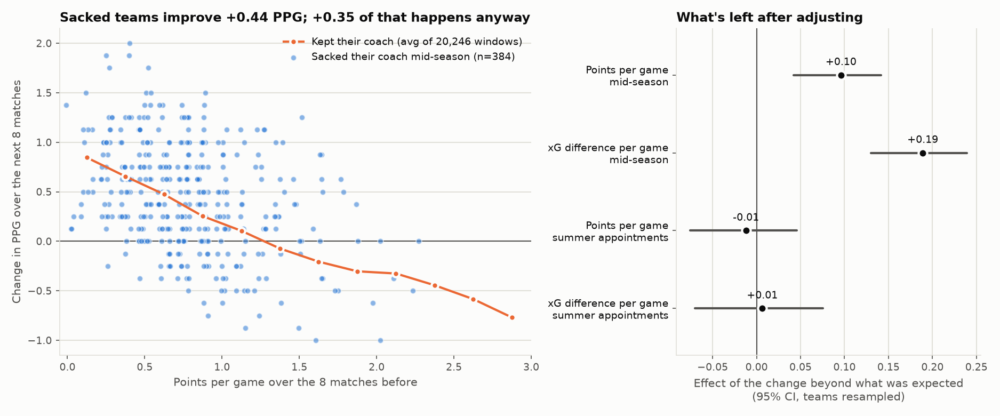
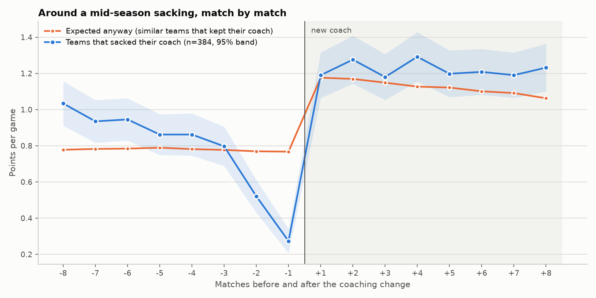
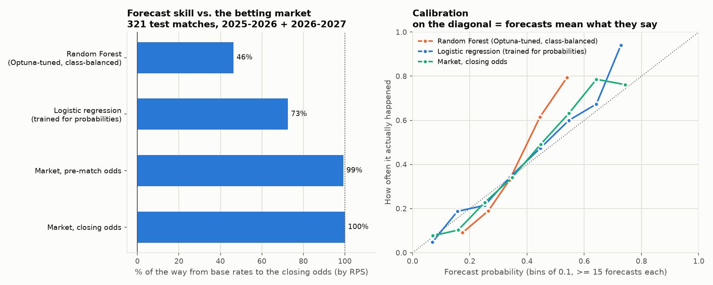
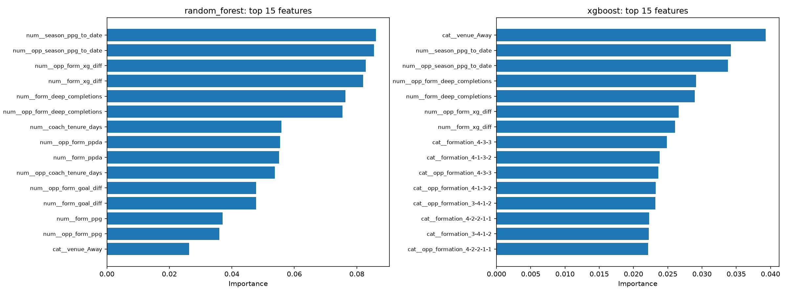
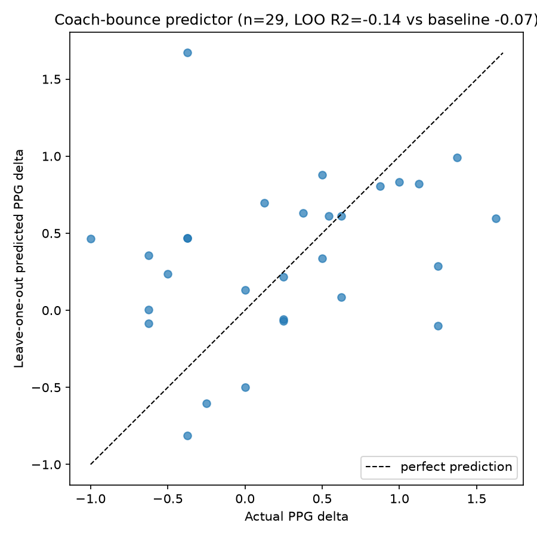
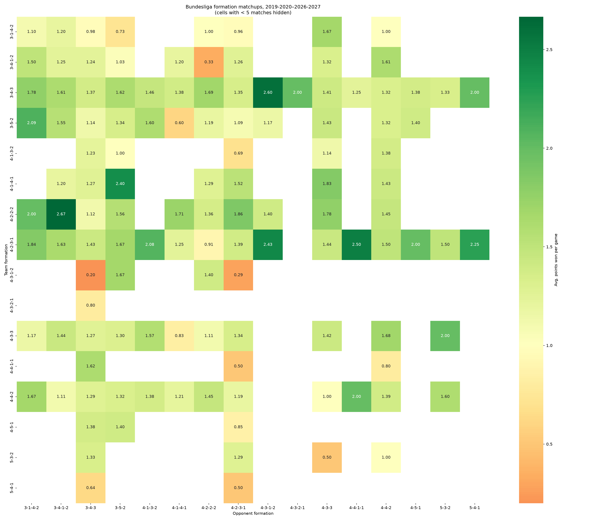
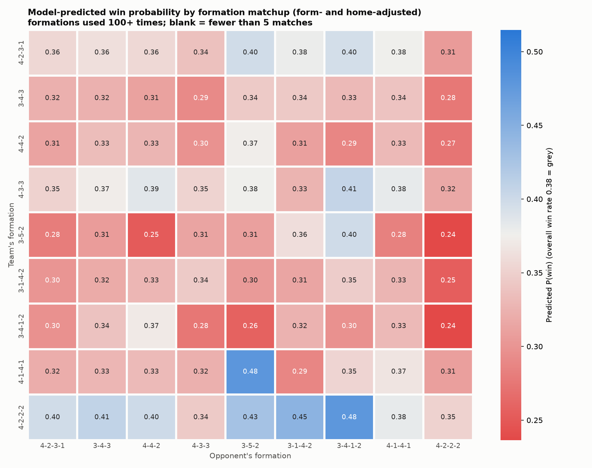

# Results in depth

The full modelling write-up. The [README](../README.md) has the headline findings;
[engineering-notes.md](engineering-notes.md) covers the pipeline, tests and automation.
Every number here comes from one `bundesliga reproduce` run on thirteen seasons of data
(2014-15 to 2026-27, through 2026-09-20). The coaching-change study covers Europe's top five
leagues; everything else is the Bundesliga. The held-out test set for the forecasting
models is the 2025-26 season plus the 2026-27 matches played so far (321 matches).

- [The effect of a coaching change](#the-effect-of-a-coaching-change)
- [Match forecasts vs. the betting market](#match-forecasts-vs-the-betting-market)
- [The outcome classifiers](#the-outcome-classifiers)
- [Hyperparameter tuning, and what didn't replicate](#hyperparameter-tuning)
- [XGBoost native categorical splits](#xgboost-native-categorical-splits)
- [Coach-bounce predictor](#coach-bounce-predictor)
- [Formation matchups](#formation-matchups)

## The effect of a coaching change

`src/coach_change_effect.py`, run with `bundesliga coach-effect`, on five leagues: the
Premier League, La Liga, Bundesliga, Serie A and Ligue 1, 2014-15 to 2026-27 (see
[More leagues](#more-leagues) for how they're combined).

A raw before/after comparison of a sacking is badly confounded: clubs sack coaches after
bad runs, and bad runs recover on their own. So every coaching change is compared with
"control" windows: the same 8-matches-before / 8-matches-after comparison at moments
when a team did **not** change coach.

- **Windows.** For each team and match *i*: the 8 matches before *i* vs. the 8 from *i*
  on. "Treated" if the coach changes exactly at *i* (and the before-half belongs to a
  single coach); "control" if one coach covers all 16 matches; otherwise skipped.
- **Mid-season vs. summer.** A window spanning the summer break mixes in transfers and
  pre-season. So mid-season sackings (the "new coach bounce" people argue about) are
  the headline, and summer appointments are estimated separately against summer-spanning
  controls.
- **Adjustment.** The expected change for each treated window comes from a linear
  regression fit on control windows only. It uses PPG before (how bad the run was), xG
  difference before (how much of it was bad luck rather than bad play), the change in
  fixture difficulty between the two halves (below), and one intercept per league.
  Regression to the mean is linear in the before-value, and the binned control means sit
  on the fitted line (see the chart).
- **Uncertainty.** Control windows from one club overlap and are strongly correlated, so
  the 95% intervals come from a bootstrap that resamples whole clubs.

A first attempt, on the Bundesliga's first 39 sackings, used coarsened exact matching
instead of the regression. It had to drop 11 of them: the worst runs, where control
windows are rare. Those are exactly the cases the question is about, so it was replaced.

| All five leagues | n | Raw change | Expected anyway | Effect | 95% interval |
|---|---|---|---|---|---|
| **Points per game, mid-season** | 384 | +0.44 | +0.35 | **+0.10** | +0.04 to +0.14 |
| **xG difference per game, mid-season** | 384 | +0.30 | +0.11 | **+0.19** | +0.13 to +0.24 |
| Points per game, summer | 384 | +0.15 | +0.17 | −0.01 | −0.08 to +0.05 |
| xG difference per game, summer | 384 | +0.06 | +0.06 | +0.01 | −0.07 to +0.08 |

*(controls: 20,246 mid-season windows, 9,113 summer-spanning)*

| Mid-season, league by league | n | Raw change | Expected anyway | Points effect | xG difference effect |
|---|---|---|---|---|---|
| Premier League | 71 | +0.49 | +0.36 | +0.12 (−0.01 to +0.23) | +0.14 (+0.02 to +0.24) |
| La Liga | 91 | +0.40 | +0.35 | +0.05 (−0.07 to +0.14) | +0.14 (+0.01 to +0.23) |
| Bundesliga | 65 | +0.54 | +0.35 | +0.19 (+0.04 to +0.30) | +0.31 (+0.11 to +0.46) |
| Serie A | 83 | +0.45 | +0.36 | +0.09 (−0.02 to +0.19) | +0.18 (+0.06 to +0.28) |
| Ligue 1 | 74 | +0.36 | +0.29 | +0.07 (−0.03 to +0.15) | +0.21 (+0.08 to +0.31) |

*(each league on its own, against its own comparison windows)*

**Reading it.** About 78% of the points "bounce" after a mid-season sacking
is what similar teams that kept their coach did anyway. The remaining +0.10 PPG
is the effect of the change, and its interval clearly excludes zero. The two measures
agree: across the control windows, +1 xG difference per game goes with
+0.62 points per game over 8 matches. So the xG effect implies
+0.12 PPG (+0.08 to +0.15), close to the measured
points effect. Summer appointments show no effect on either measure. Every league's interval contains the pooled estimate,
so the data are consistent with one small effect everywhere. With 65 to 91 sackings per
league, they can't rule out moderate differences between leagues either.

**How the estimate evolved.** The study grew in three steps:

| Data | Mid-season sackings | Points effect |
|---|---|---|
| Bundesliga, first 8 seasons (no fixture adjustment) | 39 | +0.09 (−0.06 to +0.23) |
| Bundesliga, 2014-15 on | 65 | +0.19 (+0.04 to +0.30) |
| Five leagues, 2014-15 on | 384 | +0.10 (+0.04 to +0.14) |

The Bundesliga-only +0.19 turned out to be the highest of the five leagues, as a small
sample's estimate often is. With six times the sackings, the interval is less than half
as wide. The Bundesliga's biggest positive surprise is Tayfun Korkut replacing Hannes Wolf
at Stuttgart in February 2018: 0.50 → 2.25 PPG, against an expected +0.59.

**Match by match.** The same regression, fit on each single match's points instead of
the 8-match average, gives the expected points at every position from 8 matches before
the change to 8 after (`event_study()`; `outputs/coach_change_event_study.png`):

Two things show up that the 8-match averages hide:

- **A late collapse.** Sacked teams were doing slightly *better* than expected until three
  matches before the change, then collapsed: 0.52 and
  0.27 points per game in the last two matches, against about
  0.77 expected. Across all 8 matches before, the lines average the
  same by construction (PPG before is a covariate), so only the shape there is informative,
  not the level.
- **A steady lead after.** After the change, sacked teams sit above the expected line in
  all of the eight matches. The gap averages exactly the headline
  +0.10, since least squares is linear in the outcome.

That late collapse raises a fair objection: a team sacked after two heavy defeats might
rebound more than its 8-match form suggests, whoever the coach. So the estimate was re-run
with PPG over the last two matches as an extra covariate (reported in every run as
`mid_season_specifications.plus_last_2_matches`):

| Mid-season, adjusted for | Points effect | xG difference effect |
|---|---|---|
| PPG and xG before, fixtures, league baselines (headline) | +0.10 (+0.04 to +0.14) | +0.19 |
| … plus PPG in the last 2 matches | +0.09 (+0.04 to +0.14) | +0.18 |

Among control windows, the last two results add almost nothing once the 8-match form is
known (coefficient −0.02). So the effect is not an artefact of when clubs pull the
trigger.

**Fixture difficulty.** Every match is rated by the points an *average* team would expect
from it: the opponent's season-average rating in the betting market, plus home or away
(`src/fixture_difficulty.py`), fit within each league. The change in that rating between
the 8 matches before and after is a covariate. Only the opponent and the venue enter,
never the sacked team's own odds, which already price in the new coach and would subtract
part of the effect being measured.

- **The rating is on the right scale.** The fitted coefficient is
  0.99: a run of fixtures worth
  +0.1 PPG to an average team is worth +0.1 PPG here.
- **Sacked teams didn't get easier fixtures.** Their next fixtures were barely easier than
  usual (+0.004 PPG, against 0.000 for controls).
- **The adjustment still matters a little.** It moves the estimate from
  +0.07 to +0.10.

**Could it just be new signings?** Clubs can only register players during two transfer
windows. So the mid-season sackings split into two groups, each compared against control
windows of the same kind:

- a window was open during the 8 matches after the change;
- it wasn't, and the squad was frozen.

The window dates are the German ones, listed with sources in `config.TRANSFER_WINDOWS`,
and are used for all five leagues. The others' dates differ by days to weeks (England's
summer window closed before the season in 2018 and 2019), so this split is approximate
outside the Bundesliga.

| Mid-season sackings | n | Points effect | xG difference effect |
|---|---|---|---|
| Window open after the change | 145 | +0.08 (−0.01 to +0.16) | +0.22 (+0.12 to +0.31) |
| No window after the change (squad frozen) | 239 | +0.10 (+0.03 to +0.17) | +0.17 (+0.09 to +0.23) |

The points effect holds with a frozen squad, so new signings aren't what drives it. The
comparison already absorbs the *usual* January effect, since control windows from the same
period include other clubs' January signings too. What it can't absorb is a sacking club
signing more than usual.

### More leagues

The study is built to run on several leagues at once (`src/league_data.py`,
`data/processed/league_matches.parquet`). The Bundesliga keeps its full pipeline. The
Premier League, La Liga, Serie A and Ligue 1 add:

- **results and xG** from Understat, 2014/15 on;
- **odds** from football-data.co.uk, for fixture difficulty, with ratings fit within each
  league;
- **coaches** from Transfermarkt (`src/fetch_league_coaches.py`, run by `bundesliga
  backfill`).

Club names differ between sources ("Man United", "Manchester United"). So football-data's
names are paired with Understat's by fixtures, not by spelling: within each league-season,
a pairing needs at least 3 matches with the same date and score, and at least twice as
many as any other candidate. Per season, because Understat renamed Parma after the club's
2015 re-founding. Check: 99.15% of the 18,131 mapped odds rows are an exact Understat
fixture (same date and clubs), and 99.99% of those have the same result. The remainder
are late kick-offs that the two sources date a day apart.

Three rules keep the pooled estimate honest:

- **Complete leagues only.** A league joins only once at least 95% of its team-matches
  have a known coach. A partly-covered league would be worse than none: a missing sacking
  becomes a "kept their coach" comparison window.
- **One baseline per league.** Pooled, each league gets its own intercept in the
  comparison regression. Without them, a league whose bad runs simply recover faster
  would look like a coaching effect; `tests/test_league_data.py` plants exactly that
  confound and checks the intercepts remove it.
- **Clubs stay distinct.** Windows and bootstrap clusters are keyed by league and club.

The results then report every league on its own as well as pooled.

**Checks.**

- **The combination changes nothing for the Bundesliga.** Before the other leagues had
  coach data, the combined table reproduced every Bundesliga-only result exactly.
- **The coach data is complete.** On 30 Sep 2026 all 141 other-league clubs had verified
  coach histories, from Transfermarkt's league pages (see the engineering notes), and
  every league has a known coach for 100% of its team-matches.
- **The sackings are plausible.** There are 5 to 8 mid-season sackings per league-season,
  and spot checks match real events (Dyche → Moyes at Everton, January 2025).

### How this compares with published research

Three peer-reviewed studies answer the same question against a comparison group, and all
three find no detectable effect of a mid-season sacking:

| Study | Data | Design | Finding |
|---|---|---|---|
| Heuer, Müller, Rubner, Hagemann & Strauss (2011), [*PLoS ONE* 6(3): e17664](https://doi.org/10.1371/journal.pone.0017664) | Bundesliga 1963/64–2008/09, 154 in-season dismissals | 10 matches before and after; about 100 control teams per dismissal with the same goal difference before | +0.018 ± 0.036 points per match (standard error): "basically no effect" |
| van Ours & van Tuijl (2016), [*Economic Inquiry* 54(1): 591–604](https://doi.org/10.1111/ecin.12280) | Eredivisie, 14 seasons | a control group of coach replacements that were likely but did not happen | teams improve after a change, but the control group improves too: no effect |
| Lundkvist, Holmström, Pérez-Ferreirós & Kalén (2026), [*J. Sports Sciences* 44(13): 1760–1768](https://doi.org/10.1080/02640414.2026.2698238) | 331 changes, first and second divisions of Europe's top five countries, 2017/18–2021/22 | matched on identical five-match points trajectories; points and expected points over the next 10 matches | −0.18 to +0.13 points per match across specifications, every interval including zero |

One Bundesliga study points the other way. Kleinknecht & Würtenberger (2022),
[*Managerial and Decision Economics* 43(3): 791–812](https://doi.org/10.1002/mde.3419), use a
synthetic-control design and report performance improvements after within-season
changes. The paper is paywalled, so its effect size isn't compared here.

**Our data through their designs.** To separate "different data" from "different method",
`published_designs()` reruns this project's five-league data (2014/15 on) with the two
designs that can be reproduced from match data. Both compare the level after the change
with teams matched on the before period:

| Mid-season, five leagues | n | Points per game | Second outcome |
|---|---|---|---|
| This project's design: 8 matches before/after, adjusted for PPG, xG, fixtures, league | 384 | **+0.10 (+0.04 to +0.14)** | xG difference +0.19 (+0.13 to +0.24) |
| Heuer et al.'s design: 10 before/after, matched on goal difference | 296 | +0.08 (+0.01 to +0.13) | goal difference +0.12 (+0.02 to +0.19) |
| … same windows, this project's adjustment | 296 | +0.08 (+0.02 to +0.13) | |
| Lundkvist et al.'s design: matched on the last 5 results, 10 matches after | 414 | +0.02 (−0.04 to +0.07) | xG difference +0.08 (−0.004 to +0.14) |
| … same windows, this project's adjustment | 414 | +0.06 (+0.005 to +0.10) | |

Measured this project's way, the result doesn't hinge on the choice of 8 matches
(`horizon_sensitivity()`, always 8 matches before; longer horizons lose late-season
sackings):

| Matches measured after the change | 4 | 6 | 8 | 10 | 12 |
|---|---|---|---|---|---|
| Sackings | 424 | 407 | 384 | 353 | 321 |
| Points effect | +0.12 | +0.10 | +0.10 | +0.08 | +0.08 |
| 95% interval | +0.06 to +0.18 | +0.04 to +0.15 | +0.04 to +0.14 | +0.03 to +0.12 | +0.03 to +0.12 |

**Reading it.** Every study agrees that most of the bounce is regression to the mean. With
five leagues, the question the Bundesliga alone couldn't settle has an answer:

- **What's left is small but real:** about +0.10 points per game. It clears
  zero at every horizon from 4 to 12 matches, somewhat larger over the shorter ones.
- **Heuer et al.'s design finds it too:** +0.08 (+0.01 to +0.13).
- **Lundkvist et al.'s design doesn't:** +0.02 (−0.04 to +0.07). It matches on the last five results
  alone. On the same windows, this project's adjustment (xG, fixtures, league baselines)
  gives +0.06 (+0.005 to +0.10).

The published nulls fit this picture: an effect of about +0.1 takes hundreds of sackings
to separate from zero. Heuer et al.'s own 1963–2009 estimate (95% roughly −0.05 to
+0.09) overlaps the bottom of this project's interval, and Lundkvist et al.'s intervals
include +0.1.

**The collapse before a sacking: luck or real?** Lundkvist et al. found results collapsing
before a dismissal (1.28 → 0.34 points per match) while expected points stayed stable, and
concluded that clubs react to bad luck. The same collapse in results shows up here, but
chance quality doesn't stay stable (`event_study_xgd` in the output):

- until three matches before the change, sacked teams' xG difference was better than
  expected (about −0.39 per game against −0.50);
- then it fell to −0.67 and −0.81, against about
  −0.47 expected;
- the interval for the final match (−0.94 to
  −0.69) is clear of the expected value.

Across these five leagues, the last straw before a sacking is usually a genuinely bad
performance, not only a bad result.

**Limitations.**

- **Precision.** 384 mid-season changes separate the effect from zero, but
  leave its size uncertain (+0.04 to +0.14) and can't tell the leagues apart.
- **Method.** The windows are 8 matches; the adjustment is linear; transfer windows use
  German dates for every league; caretaker spells are kept as changes.
- **Clubs don't sack at random.** A club might sack precisely when it expects the run to
  continue, which would bias the effect downward.
- **"The change" is more than the coach.** It means everything that changes at that moment
  (injuries, dressing-room mood, a new captain), not the new coach alone. Squad data could
  separate some of that; it is being collected for the Bundesliga.

## Match forecasts vs. the betting market

`src/market_benchmark.py`, run with `bundesliga benchmark`.

Beating "always pick the home team" says little. The benchmark that matters in football
forecasting is the betting market, whose odds reflect injuries, lineups, form and a lot
of money. Forecasts are scored with proper scoring rules — **RPS** (ranked probability
score, the football standard, since home win/draw/away win are ordered), log loss and
Brier score — against margin-free implied probabilities from the market-average odds on
football-data.co.uk.

| Forecaster | RPS | Log loss | Accuracy | Gap closed |
|---|---|---|---|---|
| Base rates (training-set home/draw/away frequency) | 0.2314 | 1.067 | 44.5% | 0% |
| Random Forest (Optuna-tuned, class-balanced) | 0.2122 | 1.020 | 51.1% | 46% |
| **Logistic regression (trained for probabilities)** | **0.2013** | **0.981** | **55.8%** | **72%** |
| Market, pre-match odds (Fri/Tue before) | 0.1902 | 0.948 | 55.5% | 99% |
| Market, closing odds | 0.1899 | 0.947 | 56.7% | 100% |

"Gap closed" = how far from base rates to the closing odds, by RPS. Paired bootstrap
intervals (over matches): both models beat base rates clearly, and both trail the market
clearly.

Two findings:

- **The simpler model has better probabilities.** The Random Forest was trained with
  class-balanced weights so it would predict draws at all — which raised macro-F1, the
  metric it was tuned on, but inflates draw probabilities: across the test set it gives
  draws 33% on average, against an actual draw rate of 24% (the market prices them at 24%,
  the logistic regression at 25%). A logistic regression trained without balancing, with
  regularization chosen by time-ordered cross-validation on log loss, is better on every
  probabilistic score, and `bundesliga predict` defaults to it. More training data
  widened the gap between them (70% vs. 60% of the way on eight seasons; 72% vs. 46%
  now).
- **Against Pinnacle, the sharpest bookmaker,** on the 140 matches where football-data
  has its odds (Pinnacle's columns end in January 2026), the logistic regression gets 56%
  of the way. The market average is within 2% of Pinnacle on those same matches, so the
  lower number reflects that stretch (August 2025 to January 2026) being harder for a
  form-based model, not Pinnacle being much sharper. One plausible reason, not tested:
  early-season form features still describe last season's squad.

## The outcome classifiers

`src/features.py` builds the feature table; `src/outcome_predictor.py` trains a Random
Forest and an XGBoost classifier (`bundesliga train`).

**Leak-safety is the core correctness property.** Every rolling statistic — form PPG,
goal difference, xG difference, PPDA, deep completions, season-to-date PPG, coach
tenure — is `.shift(1)`'d before the window, so a match's features come only from that
team's earlier matches. Evaluation is a strict time split: training never sees the
test seasons. A random split would leak future results through the rolling features and
overstate accuracy.

Two variants:

- **Actual formation** uses the formations fielded in the match. That's explanatory ("which
  formation choices pair with wins, given form"), not a forecast — nobody knows the
  opponent's matchday formation beforehand.
- **Pre-match** uses each team's most common formation over its last 5 matches instead, so
  everything is known before kickoff.

Training covers 2015-16 to 2024-25: FBref has no formations for 2014-15, so that season
only contributes rolling history.

| Macro F1 (accuracy) | Actual formation | Pre-match |
|---|---|---|
| Random Forest | 0.502 (52.8%) | 0.492 (51.6%) |
| XGBoost | 0.477 (49.7%) | 0.485 (50.8%) |

*(baselines: majority class 38.0%, home-advantage-only 44.5%)*

Knowing the actual matchday formation doesn't consistently help over the recent tendency:
it scores higher for one model and lower for the other, within noise. Both models clear
the home-advantage baseline by 5–8 points. Draws are weighted so the models attempt them
at all (unweighted, both learn never to predict a draw).

Deep completions (Understat passes into the final third) were added later as a feature.
On the data at the time they appeared to lift macro-F1 by 0.01–0.04 — which, by the
standard of the next section, is within noise. They're kept because they're cheap and
principled, not because they demonstrably helped.

## Hyperparameter tuning

`bundesliga tune --method grid|embargoed|optuna`.

All three methods tune on macro-F1 with **time-ordered** cross-validation
(`TimeSeriesSplit`, 10 folds) — a random K-fold would validate on matches earlier than
some of its training matches, reintroducing the leakage the time split exists to prevent.

- **Grid**: `GridSearchCV` over tree count, depth and leaf size (plus learning rate and
  subsample for XGBoost).
- **Embargoed**: the same grid, with an 18-row gap (one matchday) between each fold's
  training and validation slice, since rolling features make the first validation
  matches almost copies of the last training matches.
- **Optuna**: 50 trials of TPE sampling over a wider space.

| Macro F1 | Untuned | Grid | Grid + embargo | Optuna |
|---|---|---|---|---|
| Random Forest, actual | 0.502 | 0.495 | **0.503** | 0.493 |
| XGBoost, actual | 0.477 | 0.485 | **0.489** | 0.478 |
| Random Forest, pre-match | 0.492 | **0.499** | **0.499** | 0.492 |
| XGBoost, pre-match | 0.485 | 0.478 | **0.501** | 0.458 |

**Tuning doesn't reliably help, and each run tells a different story.** The first run
(data through Sept 12, 8 seasons) had Optuna-tuned Random Forest as the clear best
pre-match model (0.522) and the embargo fixing XGBoost specifically (+0.035 pre-match).
A week later both were gone (0.491; +0.000). With five more seasons of training data, the
embargo is now best or tied-best in every row — by 0.000 to 0.016. Three runs, three
different stories.

The tuning is deterministic — two seeded runs give identical hyperparameters and scores —
so the reshuffling comes from the data: a week of revisions to historical rows the first
time, a larger training set the second. At ~320 test matches, macro-F1 differences of a
few hundredths between tuning methods are noise; the untuned models are as good as
anything here.

One thing held up in every run: cross-validation scores (0.40–0.45) sit well below test
scores (0.46–0.50), because the early `TimeSeriesSplit` folds train on very little data,
which makes them a noisy target to tune against. The comparison that is robust is the
probabilistic one above, which uses proper scoring rules and reports confidence intervals.

## XGBoost native categorical splits

`bundesliga native-categorical`.

XGBoost 2.0+ can split on categories directly (`enable_categorical=True`) instead of
one-hot encoding them. With every hyperparameter held at the untuned baseline's values:

| Macro F1 | One-hot | Native categorical |
|---|---|---|
| Actual formation | **0.477** | 0.469 |
| Pre-match | **0.485** | 0.468 |

One-hot wins both, in all three runs. The likely reason: at `max_depth=4`, one-hot gives
each formation its own split, while a native split has to partition more than a dozen
formations into two groups at a time. Native categorical support pays off at much higher
cardinality, where one-hot's column explosion is the real problem.

## Sack-o-meter

`src/sack_o_meter.py`, run with `bundesliga sack-o-meter` and as part of every weekly
`bundesliga pipeline`. It publishes a table on the results page with three numbers per club.

**Sack risk.** This is the chance of a new coach within the next 4 matches. A logistic
regression with spline terms is fit on every club-week since 2014 that has at least 4
matches played that season (5,840 rows). Its features are:

- points per game over the last 8 matches of this season (or all of them, if fewer),
  minus what the closing betting odds expected over the same matches;
- that market expectation itself;
- the last two results;
- xG difference;
- days in the job, from the coach history, which is right for promoted clubs too;
- how far into the season it is.

The target only looks ahead within a season, so a summer appointment is not counted as a
sacking. Tested leave-one-season-out:

| | AUC | Brier | Log loss |
|---|---|---|---|
| Sack-o-meter | 0.795 | 0.0568 | 0.2085 |
| Points per game only | 0.759 | 0.0582 | 0.2167 |
| Base rate (6.6%) | 0.500 | 0.0620 | 0.2445 |

| Forecast band | Club-weeks | Average forecast | A change followed |
|---|---|---|---|
| 0%–2% | 1,286 | 1.5% | 0.5% |
| 2%–5% | 2,020 | 3.2% | 3.1% |
| 5%–10% | 1,292 | 7.1% | 6.0% |
| 10%–20% | 934 | 14.3% | 16.8% |
| 20%–35% | 298 | 24.8% | 27.2% |

A plain logistic regression ranked clubs almost as well but was overconfident at the top:
its forecasts above 35% averaged 42% and were followed by a change 22% of the time. Spline
terms with shrinkage fixed that and scored best on all three measures. Out of
sample, only 10 club-weeks now get more than 35% (maximum 38%), and 3 of those 10 were
followed by a change. The training data count 79
club-seasons with a change, so the model reflects how Bundesliga clubs usually behave, not
any one board. It predicts what clubs *do*, not what would help them.

Two details keep the table honest:

- The current coach comes from the coach history, not from the last match played. A club
  that changed coach after its last match (Gladbach in September 2026) is marked "just
  changed" instead of getting a risk.
- A coach who took over within the form window already *is* the change, so for that club
  the "with a new coach" range is the one that applies.

**Track record.** `track_record()` rescores every past season with the model that never saw
it (`season_out_predictions()`), then ranks all clubs on every matchday. For each mid-season
coaching change in a completed season, it records the club's reading after its last match
under the outgoing coach, and the reading one match earlier.

- **Changes counted:** 99. Another 15 changes that ended a spell of
  under 30 days (usually a caretaker) are kept apart, because they're easy to see coming and
  would flatter the record.
- **Too early to score:** 6, all before matchday 5, when the meter isn't shown yet.

| | Changes in the meter's top 3 | Ranked first | By chance (top 3 of 18) |
|---|---|---|---|
| After the last match under the outgoing coach | 67 of 93 (72%) | 38 | 17% |
| One match earlier | 49 of 92 (53%) | | 17% |

The reading after the last match is what the club's board saw too, often hours before
announcing the change. So the reading one match earlier is the fairer test of foresight.
The other direction matters as much: of the 980 club-weeks in the top 3, only
22% were followed by a change within 4 matches, against
6.6% for all clubs. The meter finds the clubs under pressure; most of them
still keep their coach.

**Recovery anyway.** This is expected points per game over the next 8 matches if the coach
stays. It uses the same regression on comparison windows as the coaching-change study
(teams that kept their coach, adjusted for form, xG difference and the change in fixture
difficulty), with the upcoming fixtures rated the same way. Early in the season the model
is refit with a before-window as long as the season allows, 4 to 8 matches
(`build_windows(window=k, after=8)`). It is an average: a single club's next 8 matches
spread around it with a standard deviation of about 0.5 points per game.

**What a change adds.** This is the study's mid-season estimate, the same for every club,
because nothing in the data predicts which changes work better (see the coach-bounce
predictor below). It's the five-league estimate, +0.10 per game (+0.04 to +0.14): small, but clearly above
zero. It is shown only for clubs at or below 1.6 points per game, where 95% of mid-season
sackings in the five leagues happened.

## Coach-bounce predictor

`src/coach_bounce.py`, run with `bundesliga bounce`.

Can the *size* of a coaching change's PPG swing be predicted from the team's form before
the change plus the incoming coach's own record — their results in whatever earlier
matches they coached, at any club, strictly before the appointment?

67 of 181 coaching changes have an incoming coach with at least 10 prior matches in the
data (most others are new to management, or their earlier jobs predate 2014 or were
outside the Bundesliga). Evaluated by leave-one-out cross-validation, with each feature
group also tried on its own:

| Ridge regression on… | Leave-one-out R² |
|---|---|
| Team form before the change only | **+0.33** |
| Team form + incoming coach's record | +0.28 |
| Incoming coach's record only | −0.04 |
| (predict the average) | −0.03 |

The size of the bounce *is* predictable — but entirely from how bad the run was
beforehand (`ppg_before` has by far the largest coefficient, −0.76): worse runs bounce
back harder. That's regression to the mean again, which the coaching-change analysis
above adjusts for. The incoming coach's own record adds nothing — including it makes the
predictions slightly worse. On the first 8 seasons (29 usable changes) nothing at all was
predictable; the larger sample is what made the team-form signal visible, and what makes
the absence of a coach-record signal meaningful rather than just underpowered.

## Formation matchups

`src/formation_matrix.py` (part of `bundesliga pipeline`).

Raw points per game for each pairing of the 9 formations used at least 100 times
(2015-16 onwards; FBref has no formations for 2014-15). The colour is centred on the
league average (1.38 PPG): blue is above it, red below. Cells with fewer than 5 matches
are blank, and some shown cells rest on only 5–10 matches (hover them on the
[results page](https://fpn1997.github.io/bundesliga-coach-impact/) for counts).

Raw averages mix up "this formation works" with "strong teams use this formation." The
outcome model's version (below) averages the model's predicted win probability per
pairing instead, adjusting for form and home advantage:

